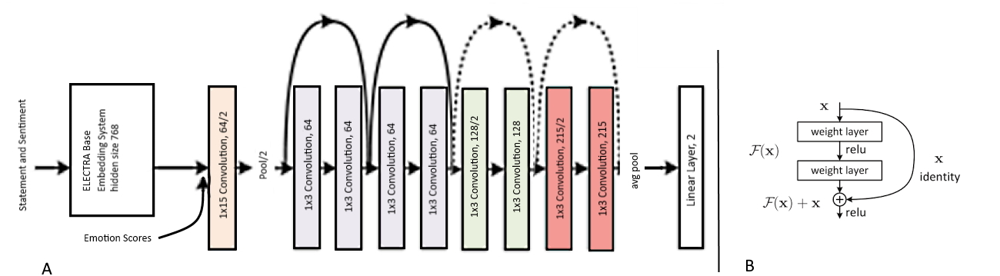
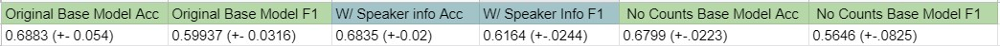
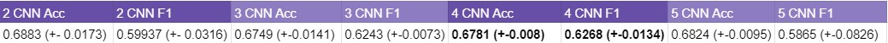
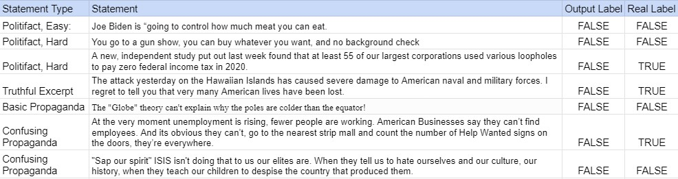
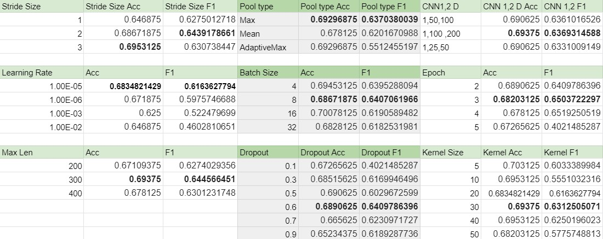
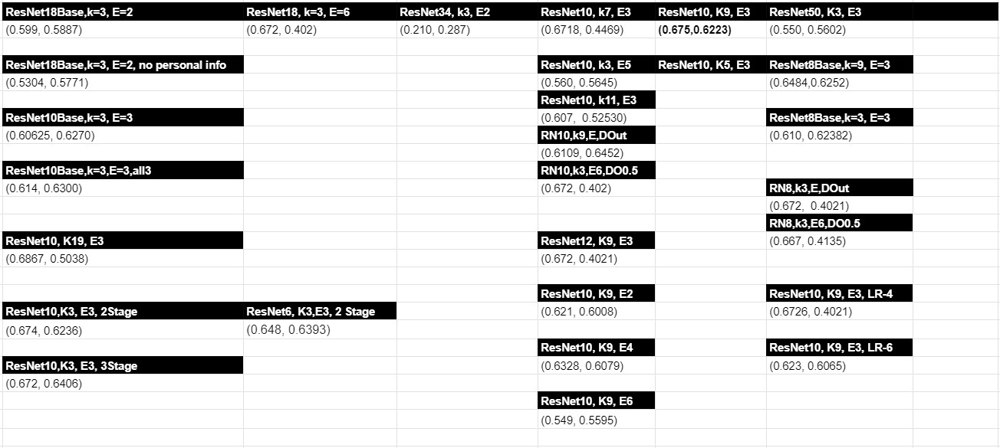

# Applying Deeper Convolutional Networks on The Sentimental LIAR Dataset

# Abstract 
We take the Sentimental LIAR (S-LIAR) dataset and network and perform network analysis and hyper-parameter tuning on the S-LIAR network. We also apply the ResNet architecture on the network for deeper learning. We find that ELECTRA embeddings are most well suited for the downstream fake news classification task. A statistically significant F1 score increase of 6.1\% was achieved. Both 4 Layer CNN and Text-ResNet10 architecture reach a similar performance levels, potentially indicating that a larger dataset is needed for better performance.

# Introduction
The maturation of the internet saw it take on a new and dangerous role in the modern political landscape. The last year has demonstrated the dangers of this new medium and the radical political hack-packs that it nurtures. Since the start ofthe Covid-19 pandemic we have seen one wave of misinformation after the other.  Early on it was the 5G stories, and agovernment operated "plandemic". Then came the Bill Gate’s Vaccination chips over the summer, as the then President pushed mask usage misinformation. We saw the meteoric rise of Q-Anon, a group of rabid conspiracy theorists who grew inpower rapidly, and in January 2021 a coalition of groups involved in Q-Anon in some way or another stormed the US Capitol believing the 2020 Election lie that Donald Trump had won, purporting to "Stop the Steal." In the past it led to the rash Brexit decision, and coordinated propaganda campaigns on Facebook are considered to have greatly contributed to incitingthe Myanmar Genocides[1]. Fake News is one of the biggest issues of our day, anything to curtail its potency is useful.The body of work on fake news detection on long form documents, ones that come with a large body of context are growingrapidly. However, short text fake news detection systems are relatively rare and they are just as important considering that commonly used social media sites use short form text. These shorter excerpts come with the issue of not having enough context and information, leaving the models trained on longer form fake news detection tasks constrained. The LIAR dataset sought so solve this issue, it contains short form texts from Politifact.com, a fact checking website[2]. The dataset was a first of its kind and is the largest public one for short form fake news classification. Sentimental LIAR took it a step further,adding in sentiment scores and emotion scores and made significant performance boosts over the original LIAR paper[1].The reliance on Statement, Sentiment and Emotions only for fake news classification comes from both the Undeutsch and Four-factor theories[1]. They imply that fake news statements are different from real news statements both in writing styleand the sets of emotions used[1]. According to these theories the Sentiment and Emotion information S-LIAR included should greatly enhance fake news detection performance. Though Fake News detection should be difficult without webscraping, following these theories with style and emotion the S-LIAR authors believe we should get decent performancewithout a researching mechanism, albeit with noise, since these style and emotion rules are not likely universal. The S-LIARpaper reports 20+% Macro F1 improvements over majority baseline. Perhaps with deeper networks and fine tuning we canmake some real improvements in performance with this dataset. The rest of this paper will include using deeper learning frame works from the field of computer vision, namely the ResNet network and larger CNN networks to see if improvements can be made on the current network. The idea being that deeper, more hierarchical learning without vanishing gradients that ResNets provide may find better features and boost the performance[8]. We also provide analysis on the model structure and input structure. The Codes for the Networks made and the Appendix of this paper will be provided in the Github

# Methods   
## Convolutional Neural Network
The Sentimental LIAR paper used BERT[13] sentence embeddings in its architecture. BERT was the first of its kind self-supervised bi-directional attention based transformer with state of the art (SOA) benchmarks in GLUE and SQuAD tasks[4]. Since BERT many new networks have come out addressing the various issues with it. Roberta and ALBERT resolve the next-sentence replacement task issues and the model size issues to get more training and more powerful embeddings[11][12].XLNet also takes a look at improving upon BERT’s use of the Masked-Language-Model (MLM) [6]. GPT-2 provides anauto-regressive model with incredible language modeling performance [10]. And ELECTRA changes the generator basednetwork of BERT into a discriminator, and resolves the primary masked token issue, in which only 15% of the data canbe trained[5]. These various networks all have their specialties and improvements on certain downstream tasks. ALBERTembeddings are seen as some of the best for tasks such as Semantic Textual Similarity (STS) and other semantic tasks[5][3].While ELECTRA authors state it outperforms on most downstream tasks in general, it does particularly well on SQuAD,Quora Question Pairs (QQP) tasks, and QNLI tasks [3], involving reading comprehension and question and answeringtasks[5]

## ResNet for Text Classification

ResNet Figure B is the image of a basic residual block.  The curving line shows the skip-connection or residual connectionthat allows the block, the two 3x3 convolutional layers in this diagram, to learn the residual instead of the final output.This allows a bypass of the vanishing gradient problem with deep neural networks. There are no gates in a ResNet skipconnection, and in a way this allows for memory to be passed along the network. It does this by taking the output of oneblock and adding it to the output of the next block. Passing it along down the network. This has allowed for very deep CNN’s to be created for very complex tasks.

Above is the architecture of the ResNet10 Text Classification Network. Each block contains two 1x3 convolutional layers.We start with the Statement and Sentiment and move them through an embedding generator as before. We then append theemotion scores to this output. We first run a 1x15 CNN layer over this input, this essentially becomes a look up table forthe rest of the ResNet. This ResNet10 network contains only 3 Expansion Stages. Each stage in a ResNet Network expandsthe number of dimensions. The normal expansion schema is [64, 128, 256, 512] for a 4 stage ResNet. After going throughthe 3 stages with residual connections, we arrive at a fully connected linear layer and a classifier. Every layer uses AveragePooling, ReLU activation functions and the first convolutional layer uses dropout for stability. In experiments we will detailmore model types, and of different sizes, but ResNet10 with 3 Stages is our primary ResNet model.

# Experiments
We wanted a model that was as powerful as possible but also as usable as possible.  The Politifact.com set-up for eachquestion would constrain a network to only work on that website.  We want a model that has more general uses.  As aresult we also focused on generalization. In the same branch of logic we want to make sure the model is actually using thestatements and its embeddings to make decisions and want to understand where the model is getting performance boostsfrom. Below is a number of experiments that seek to answer all of these questions and cover all of these topics.
## Sentimental LIAR vs LIAR
The original LIAR paper contained 5 classes ranging from "Pants on fire" to "Mostly True" as stated previously.  We wanted to run the 2 Layer CNN network (Original LIAR paper did not specify these parameters) and test the original LIAR paper for a more direct comparison. We also were curious how much a boost the Sentimental LIAR paper received bythe reduction of the number for classes from 5 to 2, the binary True and False. The Table below shows the results of this experiment. 

It is clear that the Sentimental LIAR network, that is including the sentiments and emotion scores gets a boost on themore important F1 score (imbalanced dataset), but that the overall performance of the network is granted via the binaryclassification system. These models were only run once.

## Generalization
Going through the total architecture of the Sentimental LIAR network we noticed a few issues. One was that the use ofSpeaker name, job, party affiliation, and so would not generalize well outside of Politifact. So we ran an experiment to seehow much of a performance change would come from removing the speaker information. We also noticed an odd addition.On Politifact.com a team of journalists votes on the Truthfulness of the statement, this creates a vote count for the six LIARclasses. Reading the journalist vote counts makes it incredible easy to distinguish truth and fact, this should in no waybe included in the network. Since all this will do is set the network up to look for these counts to make an easy decision,this is useless.  Taking the Speaker info out we see a small increase in the F1 score.  Likely due to making informationmore salient, less info means its easier to distinguish important features elsewhere. We notice without the vote counts theperformance on the F1 score drops 5 points to 0.5646. Standard Deviations are shown next to the results below.

## Different Embeddings
As stated before RoBERTa, ALBERT, XLNet, GPT-2, and ELECTRA are some of these new, state of the art models.RoBERTa and ALBERT seek to resolve the next-sentence prediction task and increase training size and performance.ALBERT is state of the art on semantic text tasks such as STS and SST tasks.  ELECTRA changes the generator to adiscriminator. ELECTRA has state of the art performances on question and reading comprehension tasks. Below shows theresults of all of these models. This experiment was run before the vote counts were taken out, changes should be the samesince these apply to statement embeddings. For ELECTRA and non-sentence embeddings systems we used an averagingmethod for sequence embeddings.

ELECTRA likely outperformed all of the other models since it outperformed them on SQuAD, QQP, and QNLI tasks in theoriginal ELECTRA paper. These tasks involve finding important entities within the text that answer questions and involvedreading comprehension. This type of important entity recognition is likely very important to fake news classification.

## CNN Fine Tuning
The Table below shows the results of different CNN layer testing. We testing up to 5 Convolutional Layers and found that4 CNN layers gave the best performance. This is likely because while the deeper network is better at a certain point thesystem is constrained either due to vanishing gradients and/or not enough data to train all the parameters well. In this casewe believe both reasons apply. Thus the optimum point is 4 Layers. Many other smaller changes were made such as thekernel sizes, channel sizes, dropout, etc. All of these are included in the Appendix.

## ResNet Fine Tuning
For ResNet we also performed a multitude of model and hyperparameter testing, all of which is also included in the GithubReadMe. These include different stage sizes and models up to ResNet50. Below are the comparisons of the best ResNetmodels we found.  Each of the below networks uses the initial 1x15 CNN layer and 1x3 CNN Residual Blocks.  TheResNet10 network that was drawn above had the best results. Likely by ResNet 18 there is not enough data and accuracydegradation starts to set-in. This is further observed by a larger standard deviation on the F1 score, demonstrating thatthe model was more sensitive to small training changes at 18 layers.  Too many epochs quickly led to validation scoredegradation. ResNet10 with 3 Stages and a dropout layer between the first CNN and the ResNet model is the best model.

## Simple Feed Forward Model and Final Comparison
 We wanted to make sure that the statements were actually contributing to the networks performance. We noticed that the F1score and accuracy were the same as the percentage of False tokens in the label-set. This means that a network could justsay everything it sees is False and get a score of 65% on accuracy, which is around where we are, and 0.78 for F1 score.So we ran a very simple Feed Forward network on just the Sentiment score and emotion scores to test its performance.It is clear that the CNN’s and ResNet systems with the embeddings are actually contributing to the performance here.The table below has all the best models, including the Feed Forward network just described. Note that the 4 Layer CNNand ResNet10 models are a statistically significant increases over the Original Model. With p values of 0.028 and 0.023respectively (α< 0.05). However, ResNet10 is not a statistically significant increase over the 4 Layer CNN, with a p-valueof 0.45
 
 
 
## Model Demonstration 
We performed a final test on the model which was to manually give it 7 statements and analyze its decisions on thesestatements. The statements build in difficulty (subjective) and come from a variety of sources, including Politifact. Sadlythe model did as we feared and predicted all of these statements were False.  Including F.D.R’s Pearl Harbor speech,although the sigmoid output for that one was [47, 53], it was close to a neutral prediction.

# Conclusions
We introduced ResNet architecture to the Sentimental LIAR dataset, performed analysis on the network, the data and theoriginal Sentimental LAIR CNN network. We also fine tuned the models for maximum performance in accuracy and the F1score.Firstly we make our case that it is better to create more robust models that are given proper hints [Emotion, sentiment]rather than direct hints that essentially give the network the answer such as the vote counts. Generalization outside theenvironment of Politifact is also a good practice, since short form texts are common on twitter localizing this network toPolitifact would make it useless there. We solved these issues by hiding speaker info and the vote counts.We found ELECTRA’s replace token task allows it to perform better for SQuAD, QQP (Quora Question Pairs) and QNLI.These tasks involve pulling important entities from a text that are useful for the task.  SQuAD tasks involve actuallyanswering a question and thus focus on reading comprehension.  This is clearly more important for the Fake Newsclassification than the SST (semantic tasks) or other transferable downstream tasks.Through hyper-parameter tuning on the Sentimental LIAR CNN network we find that more layers leads to more features aslong as you can train them. This allows for higher representative learning, and with CNN’s allows for higher hierarchicallearning of more complex and non-linear features. Just as with an image. We found the optimal junction of training dataand deepness of the learning architecture at 4 Covolutional Layers, this have an increase in F1 performance over the originalarchitecture of 0.062, a statistically significant increase.The ResNet10 architecture with its residual connections allowed for deeper learning but it appears it and the 4 LayerCNN have saturated at around 67% accuracy and an F1 score of 0.627. It is clear that the ResNet Architecture provided anoticeable boost over the original network, but its lack of boost over the CNN indicates that perhaps these metrics are themost we can get out of the current dataset. We consider this the case since accuracy degradation with depth on ResNetnetworks is uncommon. The dataset is an order of magnitude smaller than even the smallest tested on the VDCNN textnetwork. We also perform a test to see if the statement and embeddings are contributing to the network at all or are theemotion and sentiment scores good enough. We find that the embeddings and CNN or ResNet architecture provides addedlearning and better performance. We also test the trained network on a small set of manually picked data. We find thatthe network has a high false positive rate. This demonstrates the concern over the relatively small imbalanced dataset. Itfurthermore shows the difficulty that providing a "True" or "False" classification on Twitter length posts is a very difficulttask.Going back to Table (X) we see that the last two statements are more interesting than a simple True or False.  The 6thstatement is True, and the 7th statement is False.  However, they are made by the same person (Fox News host TuckerCarlson), and use the same techniques of powerful imagery, fear-casting, and overly dramatized verbage that pulls peoplein. The first statement is the truthful hook that then reels the audience in. Yet, a fact checker would verify the first statement.Using the techniques involving CNN’s, ResNet’s and the ELECTRA embeddings, as well as the Sentimental LIAR authorsuse of Google and IBM API’s to classify propagandist statements in short form is a task we are interested in, and may leadto actual prevention against the spread of radical political ideologies. We intend to grab technical documents, historicaldocuments for one class, and political speeches from the last 120 years as the other, including the infamous tyrants of the1920’s to 40’s as a potential training data for a Network. Though a difficult task, using this method and the lessons learnedhere hopefully we can create a network that provides useful warnings to newsreaders that what it is they are reading ispropaganda, even if it is a "True" statement.

# References
[1]   B. Upadhayay, V. Behzadan. Sentimental LIAR: Extended Corpus and Deep Learning Models for Fake Claim Classification In proceeding ofISI 2020IEEE, 2020.

[2]   W. Y. Wang. "Liar, Liar Pants on Fire": A New Benchmark Dataset for Fake News Detection InACL 2017. 2017.

[3]   A. Wang, A. Singh, J. Michael, F. Hill, O. Levy, S. R. Bowman.  GLUE: A Multi-Task Benchmark and Analysis Platform for Natural Language UnderstandingICLR2019, 2019.

[4]   P. Rajpurkar, R. Jia, P. Liang. Know What You Don’t Know: Unanswerable Questions for SQuADACL 2018, 2018.[5]   K. Clark, M.T. Luong, Q.V. Le, C.D. Manning ELECTRA: Pre-training Text Encoders as Discriminators Rather Than GeneratorsICLR 2020, 2020.

[6]   Z. Yang, Z. Dai, Y. Yang, J. Carbonell, R. Salakhutdinov, Q.V. Le.   XLNet:  Generalized Autoregressive Pretraining for Language Understandingarxiv, 2019. citearxiv:1906.08237

[7]   Y. LeCun, L. Buttou, Y. Bengio, and P. Haffner. Gradient Based Learning Applied to Document Recognition In Proceedings ofIEEE November 1998, 1998.

[8]   K. He and X. Zhang and S. Ren and J. Sun Deep Residual Learning for Image Recognition InCoRR 2015, 2015.[9]   A. Conneau, H. Schwenk, L. Barrault and Y. LeCun. Very Deep Convolutional Networks for Natural Language Processing InCoRR 2016, 2016.

[10]   A. Radford, J. Wu, R. Child, D. Luan, D. Amodei and I.Sutskever. Language Models are Unsupervised Multitask Learners FromOpenAI, 2019.

[11]   Z. Lan, M. Chen, S. Goodman, K. Gimpel, P. Sharma, R. Soricut.  ALBERT: A Lite BERT for Self-supervised Learning of Language Representations  InCoRR 2019,2019.

[12]   Y. Liu, M. Ott, N. Goyal, J. Du, M. Joshi, D. Chen, O. Levy, M. Lewis, L. Zettlemoyer, V. Stoyanov. RoBERTa: A Robustly Optimized BERT Pretraining Approach InArXiv, 2019.

[13]   J. Devlin,  M.W. Chang,  K. Lee,  K. Toutanova.   BERT: Pre-training of Deep Bidirectional Transformers for Language Understanding.   In Proceedings of the 2019Conference of the NA Chapter of the ACL: Human Language Technologies, Volume 1 (Long and Short Papers), Minneapolis, 2019

[14]   W. Abdulla. Mask R-CNN for object detection and instance segmentation on Keras and TensorFlow. GitHub, https://github.com/matterport/Mask_RCNN , 2017

[15]   Sen K. McCarthy. Says Joe Biden is “going to control how much meat you can eat.” www.politifact.com

[16]   Pres. J. Biden. In gun policy address, Joe Biden exaggerates about background checks at gun shows. www.politifact.com

[17]   L. Jacobson. Fact-checking Joe Biden on how little some corporations pay in taxes. www.politifact.com

[18]   M. Chan A Date Which Will Live in Infamy.’ Read President Roosevelt’s Pearl Harbor Address https://time.com/4593483/pearl-harbor-franklin-roosevelt-infamy-speech-attack/

[19]   No Author. Current Weather On A Flat Earth. www.darksky.net[20]   T. Carlson. Tucker: Americans are being paid to stay home. Fox News

[21]   T. Carlson. Tucker: The West is a birthright we must preserve. Fox News

# Appendix
## CNN Fine Tuning Tests

## ResNet Fine Tuning Tests

